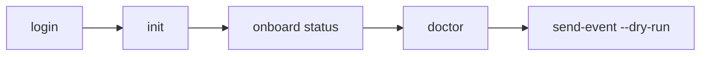

# Quick Start

## Prerequisites

- [Installed](installation.md) CLI
- [Authenticated](authentication.md) session

## Journey



## Step-by-step

```bash
# 1. Authenticate
permiso login

# 2. One-shot repo onboarding
permiso init
permiso onboard status

# 3. Next recommended step
permiso onboard suggest

# 4. Verify health
permiso doctor

# 5. Preview hook delivery (no network)
echo '{"hook_event_name":"PreToolUse","tool_name":"Bash"}' | \
  permiso hooks send-event --runtime claude --dry-run
```

## Non-interactive init

```bash
permiso init --yes --runtime cursor --scope repo
permiso init --dry-run --runtime cursor --scope repo --yes
```

## Related

- [Onboarding pipeline](../guides/onboarding-pipeline.md)
- [Hook setup](../guides/hook-setup.md)
- [Troubleshooting](../guides/troubleshooting.md)
