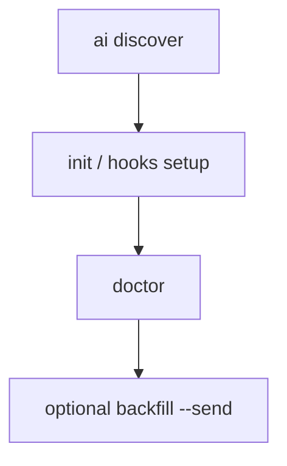

# Onboarding Pipeline

## When to use

Track and automate first-time repo instrumentation without memorizing every subcommand.

## Commands

| Command | Description |
|---------|-------------|
| `permiso init` | Guided repo onboarding |
| `permiso onboard status` | Checklist of completed steps (`--json`) |
| `permiso onboard suggest` | Print next recommended command |

```bash
permiso init
permiso onboard status
permiso onboard suggest

# Non-interactive
permiso init --yes --runtime cursor --scope repo
permiso onboard status --json
```

## Init flags

| Flag | Description |
|------|-------------|
| `--yes` | Skip confirmation prompts |
| `--dry-run` | Preview changes without writing files |
| `--runtime` | Target IDE runtime (claude, cursor, codex, vscode) |
| `--scope` | `repo` or `user` hook scope |
| `--skip-discovery` | Skip AI discovery scan during init |

## Pipeline stages



Progress is persisted in `state.json`. See [File paths](../reference/file-paths.md).

## Related

- [Quick start](../getting-started/quick-start.md)
- [Hook setup](hook-setup.md)
- [Backfill](backfill.md)
